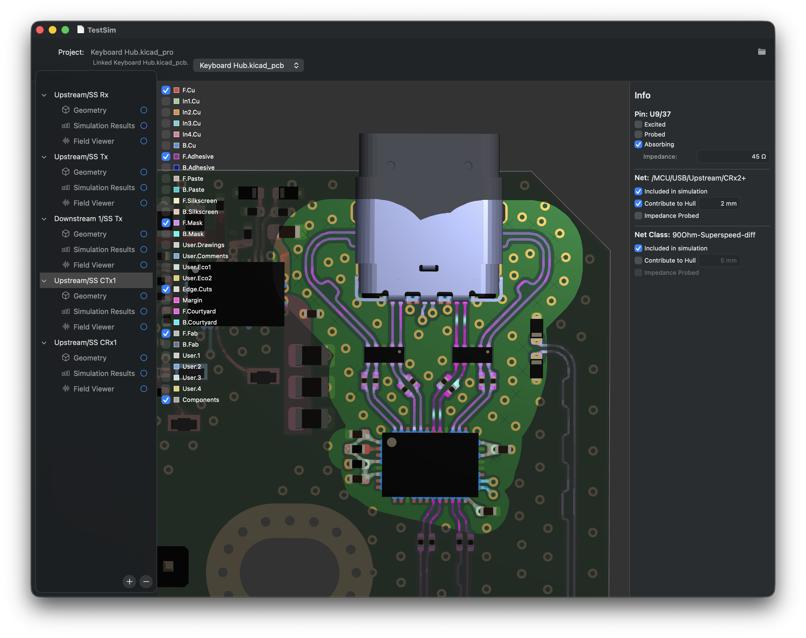
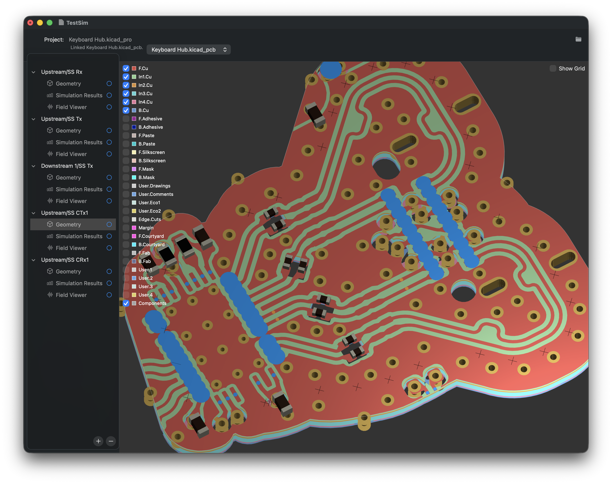
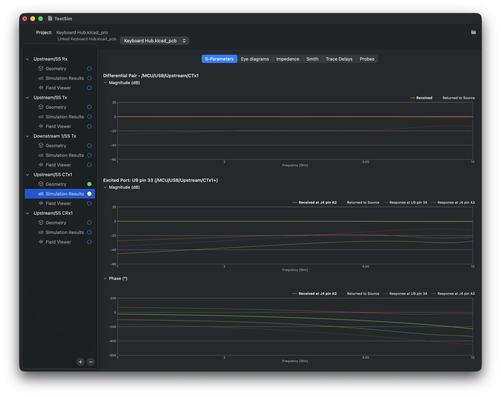
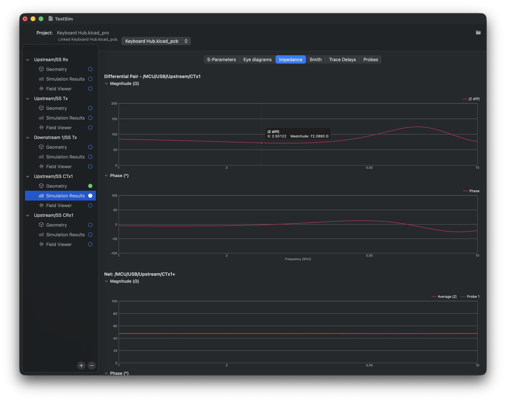
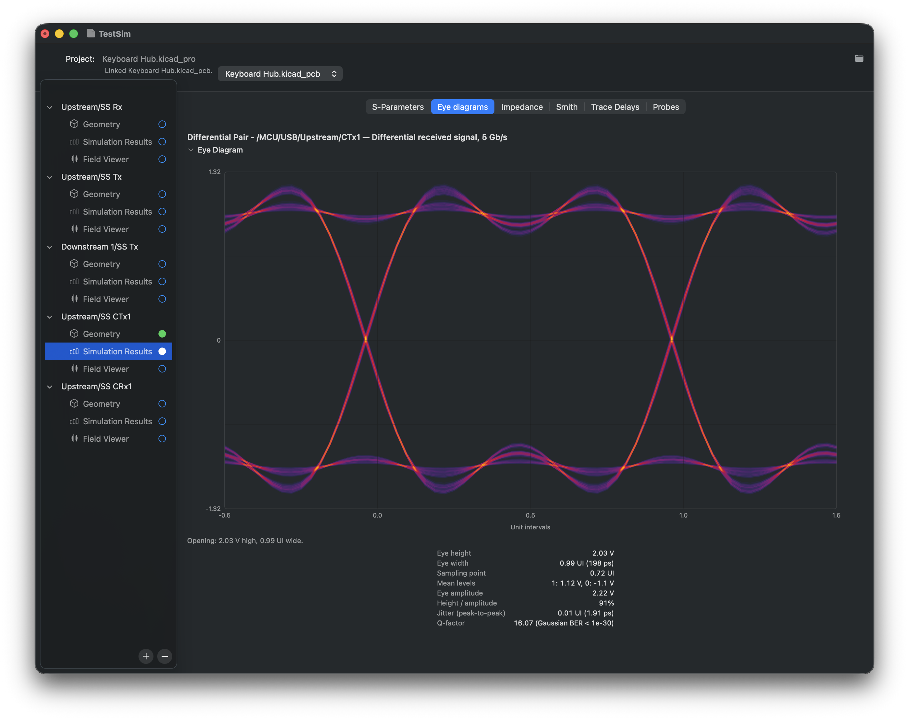
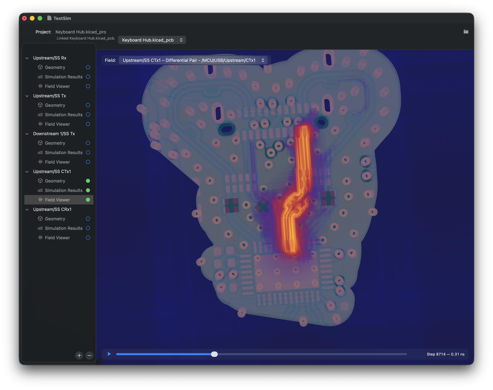

# KiEMS

KiEMS is an electromagnetic simulation tool for KiCad PCB designs. It turns a
board and simulation configuration into geometry, runs an FDTD simulation, and
produces results such as S-parameters, impedance, delay, Smith charts, probe
plots, and eye diagrams.

The repository contains three main pieces:

- **KiEMS.app** — the native desktop application for configuring, running, and
  inspecting simulations. It is **macOS-only**.
- **`kiems`** — a command-line interface for the same workflow.
- **`libkiems`** — the C++ simulation library used by both interfaces.

`libkiems` and `kiems` are intended to be cross-platform. The macOS app remains
macOS-only, but the C++ library and command-line tools have CMake build support
for macOS and Linux.

## What it does

KiEMS works from KiCad PCB data and a `simulation.json` configuration:

1. imports and preserves the board/project data needed for a run;
2. builds simulation geometry and a grid;
3. simulates each configured excitation; and
4. post-processes the output into data files and plots.

The command-line tool supports running those stages independently or together,
so geometry, simulation, and post-processing can be resumed separately.

## In the app

### Configure the board and simulations

Select the relevant layers, nets, ports, and simulation settings directly on a
rendered KiCad board.



### Inspect generated geometry

Review the derived board geometry, copper, components, and port locations
before running a simulation.



### Explore results

Browse the simulated electrical behaviour through S-parameters, impedance,
Smith charts, trace delays, probes, and eye diagrams.







### Visualize fields over time

The field viewer overlays the evolving electromagnetic field on the board and
provides timeline controls for inspecting the simulation.



## Current platform support

| Component | Status |
| --- | --- |
| KiEMS.app | macOS only |
| `libkiems` | macOS and Linux through CMake |
| `kiems` CLI | macOS and Linux through CMake |

The current project is an Apple Silicon Xcode project. It has a macOS deployment
target of 26.5.

## Requirements for the current macOS build

- macOS on Apple Silicon
- Xcode and its command-line tools
- Homebrew
- Git, including submodule support

The dependency checker installs or verifies the Homebrew formulas required by
KiEMS and its submodules. KiEMS itself requires GEOS, Matplot++, gnuplot, and
nlohmann-json; the checker also collects requirements declared by the bundled
submodules.

## Build and run on macOS

Clone with submodules, then run the dependency checker from the repository root:

```sh
git clone --recurse-submodules <repository-url>
cd kiems
Scripts/check_dependencies.py
```

The checker asks before installing missing dependencies. Use `--yes` for an
unattended setup.

Open `kiems.xcodeproj` in Xcode and select one of these schemes:

- **KiEMS** to build and run the desktop app;
- **kiems CLI** to build the command-line executable; or
- **libkiems_tests** to run the library test suite.

To run the tests without opening Xcode:

```sh
Scripts/run_libkiems_tests.sh
```

## Build on Linux

The Linux dependency checker initializes all Git submodules, builds the pinned
KiCad libraries needed by `libkicad` when they are missing or stale, detects
APT, DNF, Pacman, and Zypper, then validates the result by configuring CMake.
It prints the command required for the current distribution and never installs
packages unless `--install` is supplied.

```sh
Scripts/check_dependencies_linux.py
# Review the command, then optionally install and validate:
Scripts/check_dependencies_linux.py --install
```

Nix users can enter the fully declared development environment instead of
installing packages system-wide:

```sh
nix develop
cmake --preset linux-debug
```

The package mappings are maintained in
[`Dependencies/linux-packages.json`](Dependencies/linux-packages.json). They
are hints for each distribution; CMake's `find_package()` checks are the
authoritative validation. For a partial setup, select one or more components:

```sh
Scripts/check_dependencies_linux.py --component build --component copper
```

After dependencies and KiCad's matching source build are present, configure
and build the command-line tools:

```sh
cmake --preset linux-release
cmake --build --preset linux-release --target kiems-cli kiems_fdtd_worker copper_fdtd_worker
```

`libkiems_tests` currently uses Apple's XCTest framework, so it is built and
run through CTest on macOS only. The Linux target reports that limitation
instead of silently omitting the test suite.

## Command-line workflow

The command-line product is named `kiems`. Its default configuration is
`./simulation.json`, and paths relative to that file are resolved from the
configuration file's directory.

```sh
kiems --help
```

A typical full run imports a KiCad board and performs every stage:

```sh
kiems --input path/to/board.kicad_pcb --all
```

Useful stage flags are:

| Flag | Action |
| --- | --- |
| `--geometry` / `-g` | Create simulation geometry |
| `--simulate` / `-s` | Run the FDTD simulation |
| `--postprocess` / `-p` | Create result data and plots |
| `--all` / `-a` | Run all three stages |

By default, simulations use the openEMS CPU backend. Where the bundled Copper
backend is available, `--backend gpu` selects it. See `kiems --help` for
configuration updates, input/output overrides, field export, plotting options,
and diagnostics.

For a configuration stored at `path/to/simulation.json`, KiEMS writes its
working data relative to that file:

```text
path/to/
├── fab/                 # persisted KiCad board and project copies
└── ems/
    ├── geometry/
    ├── simulation/
    └── results/
```

Each configured simulation is kept in its own subdirectory, so multiple runs
do not overwrite one another.

## Repository layout

```text
KiEMS/                 macOS application
kiems-cli/             command-line entry point
libkiems/              shared C++ simulation library
kiems_fdtd_worker/     CPU FDTD helper executable
copper_fdtd_worker/    Copper GPU FDTD helper executable
libkiems_tests/        library tests
Scripts/               macOS dependency and test helpers
docs/                  technical notes
submodules/            Copper, libkicad, and RememberRemember dependencies
```

## Geometry backend

Geometry operations use the stable GEOS C API (`geos_c`) and require GEOS 3.10
or newer. The current setup expects a Homebrew-style installation; see
[the geometry backend notes](docs/geometry_backend.md) for details, including
GEOS licensing considerations for distributed builds.

## Development notes

`PathsConfig` keeps filesystem locations explicit, allowing applications and
tools to supply their own working layout rather than depending on a shared
process working directory. This is part of the intended portability of
`libkiems` and the CLI.

The macOS app embeds its helper tools and provides the native UI. It is the only
component whose purpose is specifically tied to macOS.
